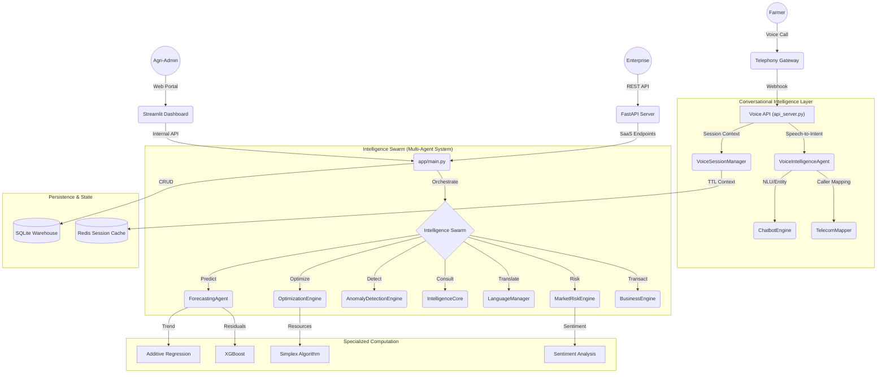

# AgriIntel 3.0: National AI Agricultural Voice Infrastructure

## 📖 Introduction
AgriIntel is a state-of-the-art **Multi-Agent Conversational AI Platform** designed to democratize agricultural market intelligence in India. It bridges the gap between complex machine learning models and end-users (farmers, traders, enterprises) through a **Speech-First interface** supporting multiple Indian regional languages.

---

## 🏗️ Technical Architecture Overview

AgriIntel follows a **Modular Multi-Agent Architecture (MMAA)**, where specialized AI agents collaborate to fulfill user requests across telephony and web interfaces.



---

## 🔌 1. The Conversational AI Stack

The Voice-First infrastructure is designed for low-latency, multi-turn interactions over standard telephony.

### 🎙️ Interaction Lifecycle
1.  **Ingress**: A call triggers `VoiceIntelligenceAgent.handle_call_start()`.
2.  **Detection**: `TelecomMapper` identifies the caller's state/circle and sets the default language (Hindi/Marathi/Odia).
3.  **STT & NLU**: Speech is converted to text; `ChatbotEngine` extracts **Intent** (e.g., `price_query`) and **Entities** (e.g., `commodity: Onion`, `mandi: Nasik`).
4.  **Context Maintenance**: `VoiceSessionManager` stores the user's current crop and mandi in Redis, enabling follow-up questions like *"What about next week?"* without repeating the crop name.
5.  **Synthesis**: The `LanguageManager` generates a regional-language response, which is converted to audio via TTS.

---

## 🧠 2. The Intelligence Swarm (Agent Deep-Dive)

AgriIntel's "Brain" consists of over 20 specialized agents.

| Agent | Technology | Primary Responsibility |
| :--- | :--- | :--- |
| **ForecastingAgent** | Hybrid XGBoost + Additive | 30-day price prediction with 95% confidence intervals. |
| **MarketRiskEngine** | Multi-Factor Scoring | Aggregates Volatility, Shock, Sentiment, and Weather risks. |
| **ArbitrageAgent** | Spatial Profit Logic | Finds price gaps across mandis considering logistics costs. |
| **OptimizationEngine** | Linear Programming | Optimizes land allocation (Simplex) and inventory (EOQ). |
| **DataHealthAgent** | Statistical Profiling | Monitors data completeness and distribution shifts. |
| **PerformanceMonitor** | Drift Analysis | Tracks Real-world Accuracy vs. Predictions; triggers retraining. |
| **GradingModel** | Computer Vision (CNN) | Visual quality assessment from crop images. |

---

## 🛠️ 3. Mathematical Foundations

### 📈 Price Forecasting
We use a **Residual-Corrected Trend Model**:
-   **Stage 1**: An additive model captures seasonal patterns and long-term trends.
-   **Stage 2**: **XGBoost** (Extreme Gradient Boosting) is trained on the residuals (errors) of Stage 1, incorporating exogenous variables like humidity, wind speed, and news sentiment.

### 🚛 Logistics Optimization (Dijkstra's & Graph Theory)
`utils/graph_algo.py` constructs a directed graph of Mandis. Edge weights represent `(Distance * FuelRate) + Tolls`. The agent finds the shortest path while maximizing `Market_Price(Destination) - Logistics_Cost`.

### 🌾 Crop Planning (LPP)
The `OptimizationEngine` solves the following:
`Maximize Z = Σ (Expected_Profit_i * Area_i)` 
`Subject to: Σ Area_i <= Total_Land, Σ Cost_i * Area_i <= Budget`

---

## 📦 4. Data & Automation Pipeline

### 🔄 Self-Healing ETL
Powered by **GitHub Actions**, the pipeline runs daily:
1.  **Ingestion**: Scrapes/Simulates Agmarknet data.
2.  **Enrichment**: Fetches OpenWeatherMap API and Google News RSS.
3.  **Validation**: `DataHealthAgent` checks for nulls or impossible spikes.
4.  **Persistence**: Updates `agri_intel.db` and pushes CSV checkpoints back to GitHub.

### 🛡️ Multi-Tenancy & RBAC
-   **Schema Isolation**: All transactions are tagged with `organization_id`.
-   **RBAC**:
    -   `Admin`: Can force data updates and manage users.
    -   `Analyst`: Can view advanced Performance and Model Drift panels.
    -   `Viewer`: General dashboard access.

---

## 🚀 5. Getting Started

### Installation
```bash
pip install -r requirements.txt
# (Optional) Install system audio libs for voice AI
# sudo apt-get install ffmpeg libasound2-dev
```

### Execution
-   **Dashboard**: `streamlit run app/main.py`
-   **API**: `uvicorn api_server:app --reload`
-   **Verification**: `python tests/test_voice_flow.py`
