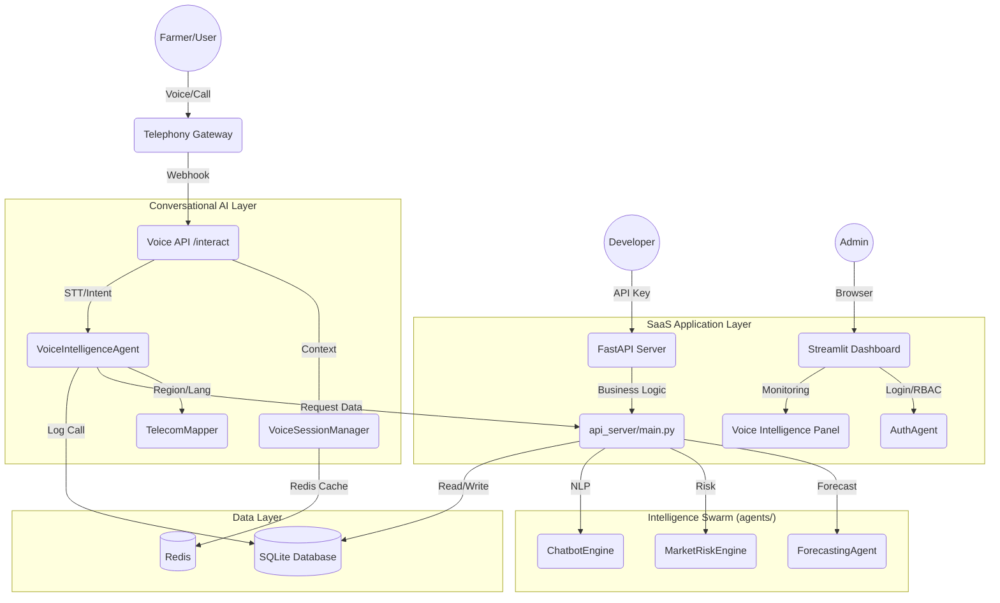

# AgriIntel System Architecture & Documentation

## 📖 Introduction
AgriIntel is a national AI agricultural voice infrastructure and market intelligence dashboard. It leverages a multi-agent system to process real-time data, forecast prices, and provide conversational intelligence in regional languages.

**Version 3.0 (Voice Edition)** introduces a full conversational AI stack, telephony-ready APIs, and real-time session management.

---

## 🏗️ System Architecture

The following diagram illustrates the integration of the Voice AI layer within the AgriIntel ecosystem.



---

## 🔌 Module Breakdown (Tip to Toe)

### 1. Conversational Voice Stack (`agents/` & `utils/`)
*   **`VoiceIntelligenceAgent`**: The orchestrator. Coordinates Speech-to-Text (STT), Intent Classification, and Dialogue Management.
*   **`VoiceSessionManager`**: Redis-backed session handler that maintains context (crop, mandi, history) across a voice call.
*   **`TelecomMapper`**: Uses caller phone numbers to map to Indian telecom circles and automatically detect regional languages.
*   **`ChatbotEngine`**: **(Enhanced)** Provides structured intent detection and entity extraction (commodity, mandi, time_horizon) for the voice agent.

### 2. SaaS & API Layer (`app/` & `api_server.py`)
*   **`api_server.py`**:
    *   `POST /v1/voice/start`: Initializes a new call session.
    *   `POST /v1/voice/interact`: Processes speech/text turns in real-time.
*   **`app/voice_admin.py`**: A new monitoring dashboard showing call volume, language distribution, ASR confidence, and live transcripts.

### 3. Intelligence Layer (`agents/`)
*   **`ForecastingAgent`**: Hybrid ML (Trend + XGBoost) for 30-day predictions.
*   **`MarketRiskEngine`**: Calculates risk scores (0-100) based on volatility, shocks, and external factors.
*   **`ArbitrageAgent`**: Identifies regional price gaps with logistics cost modeling.
*   **`LanguageManager`**: Dictionary-based translation support for English, Hindi, Odia, and **Marathi**.

### 4. Data Layer (`database/db_manager.py`)
*   **`voice_call_logs`**: Stores call history, transcripts, detected intents, and response metadata for analytics.
*   **Redis Integration**: Used for sub-second context retrieval during active voice sessions.

---

## 🛠️ Configuration & Setup

1.  **Prerequisites**: Python 3.9+, Redis (optional for local dev).
2.  **Dependencies**: `requirements.txt` (FastAPI, Redis, SpeechRecognition, gTTS, phonenumbers).
3.  **First Run**:
    ```bash
    pip install -r requirements.txt
    python etl/data_loader.py seed
    streamlit run app/main.py
    ```
4.  **Telephony Simulation**:
    ```bash
    python tests/test_voice_flow.py  # Verifies the full conversational lifecycle
    ```
