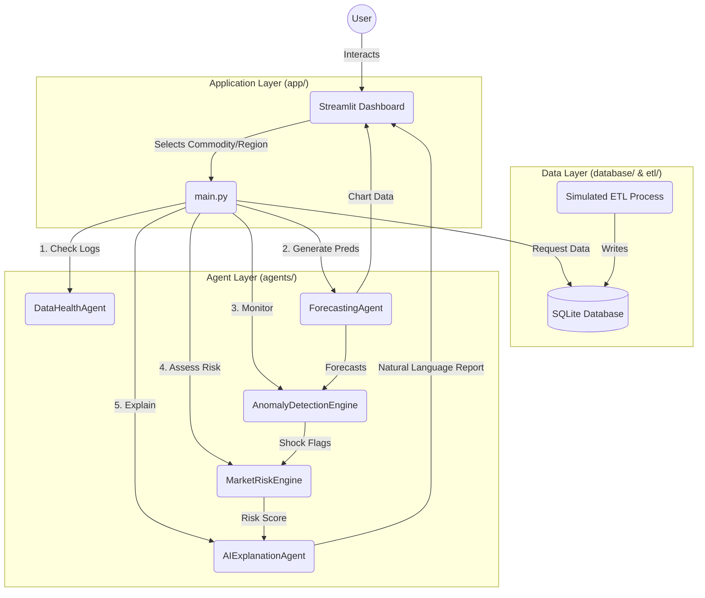

# AgriIntel System Architecture & Documentation

## 📖 Introduction
AgriIntel is a live simulated market intelligence dashboard for agricultural commodities in India. It leverages a multi-agent system to process real-time (simulated) data, forecast prices using machine learning, detect market shocks, and assess risk.

---

## 🏗️ System Architecture

The following diagram illustrates the high-level data flow and component interaction within the AgriIntel system.



---

## 🔌 Module Breakdown (Tip to Toe)

### 1. Application Layer (`app/`)
This layer handles the visual presentation and user inputs.

#### `app/main.py`
The entry point of the Streamlit application.
*   **Initialization**: Configures the page layout, title, and loads custom CSS.
*   **Dependencies**: Imports all Agents and Utils.
*   **State Management**: Uses `@st.cache_resource` to initialize agents only once to optimize performance.
*   **Execution Loop**:
    1.  **Sidebar**: Collects user preference (Commodity, Mandi).
    2.  **Data Fetch**: Calls `get_live_data` to retrieve historical traces.
    3.  **Agent Chain**: Sequentially calls agents:
        *   `health` -> `forecast` -> `shock` -> `risk` -> `explain`
    4.  **UI Routing**: Switches between views ("Market Overview", "Price Forecast", etc.) based on sidebar selection.

#### `app/utils.py`
Helper utilities for the frontend.
*   `get_db_options()`: Queries `market_prices` table for distinct Commodities and Mandis to populate dropdowns.
*   `get_live_data(commodity, mandi)`: Retrievals sorted time-series data. Includes intelligent fallbacks (dummy data) if the database is empty.
*   `load_css()`: Injectable CSS for styling the dashboard (custom colors, card aesthetics).

---

### 2. Agent Layer (`agents/`)
The "Brains" of the application. Each agent is a specialized class with a specific responsibility.

#### `agents/forecast_execution.py` (`ForecastingAgent`)
**Purpose**: Predict future prices (30 days out) using a Hybrid ML approach.
*   **Algorithm**: **XGBoost Regressor** + **Cumulative Random Walk**.
*   **Key Features**:
    *   **On-the-fly Training**: Trains a fresh model for every user request based on the latest data.
    *   **Self-Correction**: Uses a validation split to detect if the model is currently under/over-estimating and applies a "bias correction" term.
    *   **Anti-Flatline Logic**: Adds a controlled random drift ("Random Walk") to ML predictions to simulate realistic market volatility, preventing the common ML issue of "flat line" forecasts in low-variance data.

#### `agents/risk_scoring.py` (`MarketRiskEngine`)
**Purpose**: Quantify market stability.
*   **Algorithm**: Weighted Scoring System.
*   **Inputs**: Shock severity, Forecast volatility, Historical volatility.
*   **Scoring Logic**:
    *   Base Score: 0
    *   **+50**: High Severity Shock detected.
    *   **+20**: Medium Severity Shock / High Forecast Uncertainty.
    *   **+30**: High Daily Volatility (>2%).
*   **Output**: A clean 0-100 score and a "Risk Regime" label (Stable vs. Volatile).

#### `agents/shock_monitoring.py` (`AnomalyDetectionEngine`)
**Purpose**: Detect sudden, abnormal market moves.
*   **Algorithm**: Threshold-based Anomaly Detection.
*   **Thresholds**:
    *   **>15% Change**: "High" Severity.
    *   **>5% Change**: "Medium" Severity.
    *   **Else**: Normal.
*   **Usage**: Prevents users from being blindsided by sudden crashes or spikes.

#### `agents/data_health.py` (`DataHealthAgent`)
**Purpose**: Ensure trust in the underlying data.
*   **Checks**:
    1.  **Completeness**: Are there missing dates in the timeline?
    2.  **Validity**: Are there '0' price values?
*   **Output**: Renders a status badge (OK/Critical) on the dashboard (currently hidden in main view but calculated).

#### `agents/explanation_report.py` (`AIExplanationAgent`)
**Purpose**: translate numbers into words.
*   **Function**: Takes the outputs of all other agents (Risk Score, Shock Status, Forecast Trend) and fills a natural language template.
*   **Future**: Designed to be the integration point for LLM (Gemini/GPT) APIs for generated market commentary.

---

### 3. Data & ETL Layer

#### `database/db_manager.py`
Handles all SQLite interactions.
*   **File**: `agri_intel.db`
*   **Schema**:
    *   **`market_prices`**: `date` (TEXT), `commodity` (TEXT), `mandi` (TEXT), `price_modal` (REAL), `arrival` (REAL).
    *   **`news_alerts`**: `date`, `title`, `source`, `sentiment`.
    *   **`weather_logs`**: `date`, `region`, `temperature`, `rainfall`.

#### `etl/data_loader.py`
The simulation engine.
*   **`seed_historical_data()`**: Generates 90 days of realistic "Random Walk" price history for multiple commodities/mandis. Used to initialize the app.
*   **`fetch_real_weather()`**: Connects to the **Open-Meteo API** to fetch *actual* live weather for specific Mandi coordinates (Lat/Lon mapped).
*   **`fetch_mandi_prices_simulated()`**: Generates daily price updates with realistic noise to simulate a live market feed in the absence of a paid Agmarknet API subscription.

---

## 🛠️ Configuration & Setup

1.  **Prerequisites**: Python 3.8+
2.  **Dependencies**: Listed in `requirements.txt` (Streamlit, Pandas, Plotly, XGBoost).
3.  **First Run**:
    ```bash
    # 1. Install
    pip install -r requirements.txt
    
    # 2. Seed Database (Vital for first run)
    python etl/data_loader.py seed
    
    # 3. Launch
    streamlit run app/main.py
    ```
