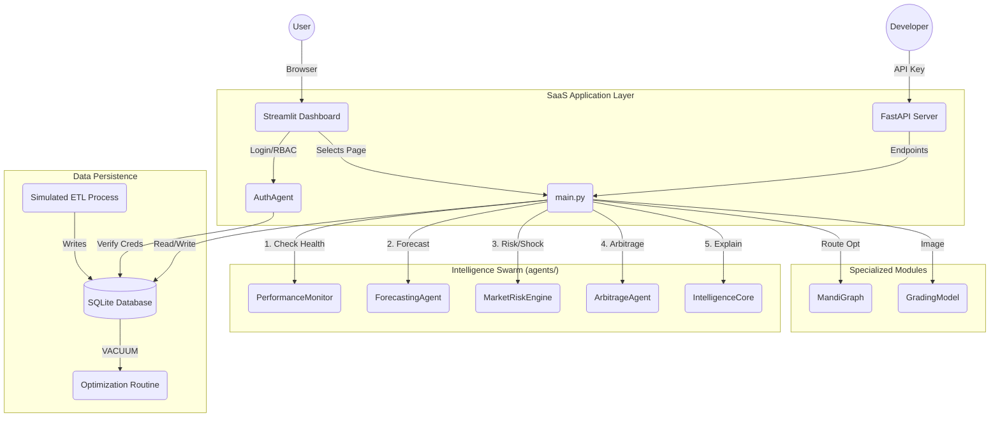
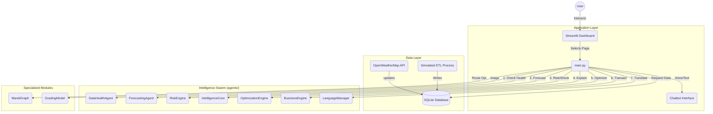

# AgriIntel System Architecture & Documentation

## 📖 Introduction
AgriIntel is a live simulated market intelligence dashboard for agricultural commodities in India. It leverages a multi-agent system to process real-time (simulated) data, forecast prices using machine learning, detect market shocks, and assess risk.

**Version 2.0 (SaaS Edition)** now includes Multi-Tenancy, API Infrastructure, Institutional Dashboards, and Advanced Risk Attribution.

---

## 🏗️ System Architecture

The following diagram illustrates the high-level data flow and component interaction within the AgriIntel system.



---

## 🔌 Module Breakdown (Tip to Toe)

### 1. SaaS & API Layer (`app/` & `api_server.py`)
This layer handles user interaction, authentication, and external connectivity.

#### `agents/auth_manager.py` (Security)
*   **Role-Based Access Control (RBAC)**: Distinguishes between `Admin` (Full Access), `Analyst` (No Config), and `Viewer`.
*   **Multi-Tenancy**: Filters data and logs based on `organization_id`.
*   **Authentication**: Supports Google OAuth and Database-backed Login (`users` table).

#### `api_server.py` (Connectivity)
*   **Technology**: FastAPI + Uvicorn.
*   **Endpoints**:
    *   `GET /v1/price/{commodity}/{mandi}`: Latest market rates.
    *   `GET /v1/risk/{commodity}/{mandi}`: Real-time risk scoring.
    *   `GET /v1/arbitrage/{commodity}/{mandi}`: Profitable trade routes.
*   **Security**: API Key validation middleware.

---

### 2. Agent Layer (`agents/`)
The "Brains" of the application.

#### Core Intelligence
*   **`ForecastingAgent`**: Hybrid ML (Trend + XGBoost Residuals) to predict prices 30 days out.
*   **`MarketRiskEngine`**: **(Enhanced)** Decomposes risk into Volatility, Shock, Sentiment, and Weather scores.
*   **`ArbitrageAgent`**: **(Enhanced)** Calculates Net Profit after Fuel/Toll/Spoilage costs and performs sensitivity analysis.
*   **`PerformanceMonitor`**: **(New)** Tracks model accuracy (MAPE) and flags "Drift" if error rates spike >20%.

#### Optimization & Business
*   **`OptimizationEngine`**:
    *   **Crop Rotation**: Uses **Linear Programming (Simplex)** to maximize profit.
    *   **Inventory**: Calculates **Economic Order Quantity (EOQ)**.
*   **`BusinessEngine`**:
    *   **B2B**: Matchmaking algorithm to connect Farmers with Buyers.
    *   **Fintech**: Credit scoring algorithm based on yield stability.

---

### 3. Data & ETL Layer

#### `database/db_manager.py`
Handles SQLite interactions and Schema Migrations.
*   **New Tables**: `organizations`, `users`, `scraper_execution_stats`, `model_metrics`, `data_quality_logs`.
*   **Optimization**: Contains `optimize_db()` to run `VACUUM` and `ANALYZE` for warehouse performance.
*   **Data Warehouse**: Supports long-term historical trend queries (`get_long_term_trends`).

#### `etl/data_loader.py`
The simulation engine.
*   **Self-Healing**: Runs daily via GitHub Actions.
*   **Performance Tracking**: Logs model accuracy to `model_metrics` after every run.

---

### 4. Specialized Modules

#### `cv/grading_model.py`
*   **Purpose**: Quality Grading (Mock).
*   **Tech**: Structural CNN Simulation.

#### `utils/graph_algo.py`
*   **Purpose**: Logistics Optimization.
*   **Tech**: **NetworkX** (Dijkstra's Algorithm) for route finding.

---

## 🛠️ Configuration & Setup

1.  **Prerequisites**: Python 3.9+
2.  **Dependencies**: `requirements.txt` (Streamlit, FastAPI, Pandas, Plotly, XGBoost).
3.  **First Run**:
    ```bash
    pip install -r requirements.txt
    python etl/data_loader.py seed  # Initializes DB
    streamlit run app/main.py
    ```


**Version 2.0 (Full Scale)** now includes Computer Vision, Linguistics, Logistics Optimization, and a Business Layer (Fintech/B2B).

---

## 🏗️ System Architecture

The following diagram illustrates the high-level data flow and component interaction within the AgriIntel system.



---

## 🔌 Module Breakdown (Tip to Toe)

### 1. Application Layer (`app/`)
This layer handles the visual presentation and user inputs.

#### `app/main.py`
The entry point.
*   **Initialization**: Configures page, loads CSS, and initializes the `agents` dictionary.
*   **Gatekeeper**: `AuthAgent` handles login/session.
*   **Navigation**:
    *   **Dashboard**: Market Overview, Forecast, Risk.
    *   **Tools**: Quality Grading (CV), Logistics (Graph), Advanced Planning (Simplex/EOQ).
    *   **Business**: B2B Marketplace, Fintech Services, Developer API.
    *   **Accessibility**: WhatsApp Bot (Chat), Language Toggle (En/Hi/Or).
*   **Migration**: Explicitly calls `db_manager.init_db()` at startup to ensure schema consistency.

#### `app/utils.py`
Helper utilities.
*   `load_css()`: Custom styling.
*   `get_live_data()`: Cached data fetcher.

---

### 2. Agent Layer (`agents/`)
The "Brains" of the application.

#### Core Intelligence
*   **`ForecastingAgent`**: Hybrid ML (Trend + XGBoost Residuals) to predict prices 30 days out.
*   **`MarketRiskEngine`**: Quantifies volatility and shock severity into a 0-100 Risk Score.
*   **`IntelligenceAgent`**: The "Consultant". Runs What-If scenarios (e.g., "Effect of Rain") and suggests "Hold Duration".
*   **`AnomalyDetectionEngine`**: Flags abnormal price spikes (>15%).

#### Optimization (Phase 3)
*   **`OptimizationEngine`**:
    *   **Crop Rotation**: Uses **Linear Programming (Simplex)** to maximize profit given Land/Budget constraints.
    *   **Inventory**: Calculates **Economic Order Quantity (EOQ)** for warehouse efficiency.

#### Business & Accessibility (Phase 2 & 4)
*   **`BusinessEngine`**:
    *   **B2B**: Matchmaking algorithm to connect Farmers with nearby Buyers (based on location/crop).
    *   **Fintech**: Scoring algorithm to assess creditworthiness based on yield stability.
*   **`LanguageManager`**: Dictionary-based translation for UI elements (English, Hindi, Odia).
*   **`ChatbotEngine`**: Regex/NLP-based intent parser for natural language queries (Text/Voice).

---

### 3. Specialized Modules

#### `cv/grading_model.py`
*   **Purpose**: Quality Grading.
*   **Tech**: Structural CNN (Convolutional Neural Network) using PyTorch/TensorFlow (simulated logic for demo).
*   **Input**: Product Image -> **Output**: Grade A/B/C.

#### `utils/graph_algo.py`
*   **Purpose**: Logistics Optimization.
*   **Tech**: **NetworkX** (Dijkstra's Algorithm).
*   **Logic**: Finds the "Best Profit Route" considering Price at Destination - Transport Cost (Distance * Rate).

---

### 4. Data & ETL Layer

#### `database/db_manager.py`
Handles SQLite interactions.
*   **Schema Migration**: Auto-detects missing columns (e.g., `wind_speed`) and updates table structure on startup.
*   **Tables**: `market_prices`, `weather_logs` (w/ wind/humidity), `news_alerts`, `signal_logs`.

#### `etl/data_loader.py`
The simulation engine.
*   **`fetch_real_weather()`**: Integration with **OpenWeatherMap API**.
*   **`run_daily_update()`**: Orchestrates the daily data refresh pipeline.

---

### 5. Automation & CI/CD (`.github/workflows/`)
The system autonomy is maintained by GitHub Actions.

#### `daily_update.yml`
*   **Triggers**: `cron` (Daily), `push` (CI), `workflow_dispatch` (Manual).
*   **Job**: `update-data`
    *   Sets up Python 3.9 environment.
    *   Installs dependencies from `requirements.txt`.
    *   Executes `etl/data_loader.py` with 10s timeout safeguards.
    *   **Self-Commit**: Uses `git` actions to push updated CSVs back to the repository, ensuring the dashboard always serves fresh data without manual intervention.

---

## 🛠️ Configuration & Setup

1.  **Prerequisites**: Python 3.9+
2.  **Dependencies**: `requirements.txt` (Streamlit, Pandas, Plotly, XGBoost, Scipy, Pillow, Requests).
3.  **First Run**:
    ```bash
    pip install -r requirements.txt
    streamlit run app/main.py
    ```
