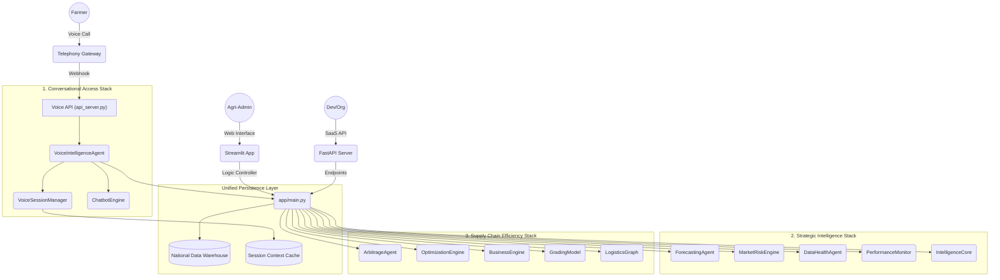

# AgriIntel.in: Technical Architecture & System Documentation

## 🏛️ System Overview
**AgriIntel.in** is a **National Unified Agricultural Intelligence Stack** powered by a **Modular Multi-Agent System (MMAS)**. It is designed to modernize agricultural market intelligence through real-time data ingestion, strategic machine learning forecasting, and conversational access layers.

---

## 🏗️ The Three-Layer Stack Architecture

AgriIntel.in operates as an integrated intelligence swarm, categorized into three strategic operational stacks:



---

## 🔌 Stack Module Breakdown

### 🎙️ 1. Conversational Access Stack
*   **VoiceIntelligenceAgent**: Manages real-time call lifecycles and dialogue orchestration.
*   **TelecomMapper**: Determines regional language preferences and geographic context via carrier circle mapping.
*   **VoiceSessionManager**: Maintains cross-turn conversational state in a **Sandbox Environment**.
*   **ASR/TTS Engine**: Pluggable interface for high-fidelity speech synthesis and recognition.

### 📊 2. Strategic Intelligence Stack
*   **ForecastingAgent**: Hybrid model performing 30-day market predictions with residual error correction.
*   **MarketRiskEngine**: Decomposes systemic risks into Volatility, Shock, Sentiment, and Weather factors.
*   **IntelligenceCore**: Natural language "AI Analyst" providing deep-dive strategic explanations.
*   **PerformanceMonitor**: Real-time tracking of MAPE/RMSE to ensure model reliability.

### 🚛 3. Supply Chain Efficiency Stack
*   **ArbitrageAgent**: Spatial econometric analysis to identify regional price discrepancies.
*   **LogisticsGraph**: Optimized routing using **Dijkstra's Algorithm** with integrated fuel and toll logic.
*   **OptimizationEngine**: Resources allocation (Simplex) and inventory management (EOQ) for agricultural planning.
*   **GradingModel**: Structural analysis for quality assessment (**Phase II Enhancement**).

---

## 📈 Data Pipeline & Governance
1.  **Ingestion**: `data_loader.py` fetches Market, Weather, and News data (**Pilot Mode**).
2.  **Processing**: The Intelligence Swarm generates unified market signals.
3.  **Governance**: `DataHealthAgent` ensures data integrity across the national stack.

---

## 🛠️ Operational Setup
```bash
pip install -r requirements.txt
python etl/data_loader.py seed
streamlit run app/main.py
```
