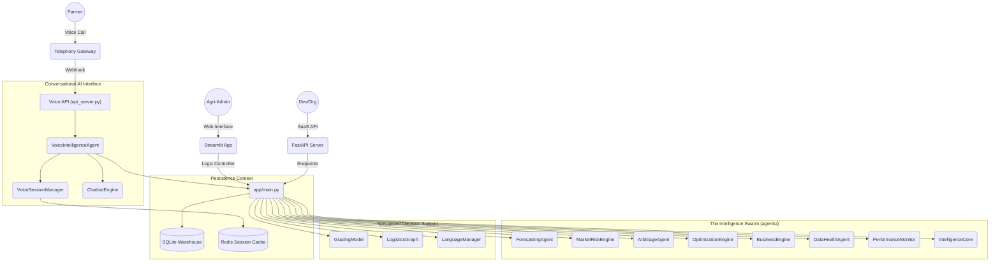

# AgriIntel: Technical Architecture & System Documentation

## 📖 System Overview
AgriIntel is a **Modular Multi-Agent System (MMAS)** designed for national agricultural market intelligence. The platform integrates real-time data ingestion, machine learning forecasting, and a conversational voice interface to serve a diverse stakeholder base.

---

## 🏗️ Core Architecture (MMAS)

AgriIntel operates as a decentralized swarm of agents, each responsible for a specific domain of the agricultural lifecycle.



---

## 🔌 Comprehensive Feature & Module Breakdown

### 1. Conversational Voice Interface (`agents/voice_intelligence.py`)
*   **VoiceIntelligenceAgent**: Orchestrates the call lifecycle (Start -> Loop -> Log).
*   **TelecomMapper**: Maps MSISDN to telecom circles (e.g., Maharashtra & Goa) to detect region and primary language.
*   **VoiceSessionManager**: Uses Redis to store "Turn State" (keeping track of the commodity/mandi being discussed).
*   **ASR/TTS Integration**: Pluggable interface for Speech-to-Text and Text-to-Speech synthesis.
*   **Call Transcript Logging**: Full persistence of user speech and AI responses for administrative audit.

### 2. Market Intelligence Swarm (`agents/`)
*   **ForecastingAgent**: Hybrid model using **Prophet-style** seasonality + **XGBoost** for residual correction.
*   **MarketRiskEngine**: Decomposes total risk into:
    *   **Volatility Score**: Standard deviation of price fluctuations.
    *   **Shock Severity**: Detection of abnormal price spikes (>1.5 z-score).
    *   **Sentiment Score**: Real-time crawling of Agri-news via RSS feeds.
    *   **Weather Risk**: Real-time integration with wind speed/rainfall data.
*   **ArbitrageAgent**: Spatial econometric model to find profit gaps between mandis after adjusting for transport and spoilage.
*   **IntelligenceCore**: Natural language "Consultant" that explains *why* a price is moving.
*   **AnomalyDetectionEngine**: Real-time monitor for "Black Swan" events in the market.

### 3. Optimization & Science Layer (`agents/`)
*   **OptimizationEngine**:
    *   **Crop Planner**: Linear programming for optimal land use.
    *   **Inventory Agent**: Wilson's EOQ model for storage management.
*   **LogisticsGraph**: **Dijkstra's Algorithm** implementation using `networkx` for cost-optimal route finding.
*   **GradingModel**: Simulated CNN for quality assessment (visual grading).

### 4. Enterprise & Data Reliability
*   **AuthAgent**: Handles RBAC, Session Security, and Multi-Tenancy.
*   **DataHealthAgent**: Automated data profiling and completeness checks.
*   **PerformanceMonitor**: Tracks MAPE (Mean Absolute Percentage Error) and RMSE to detect model drift.
*   **db_manager.py**: Centralized SQLite handler with auto-migration and optimization routines (`VACUUM`).

### 5. Deployment & Automation
*   **api_server.py**: FastAPI implementation for external SaaS integrators.
*   **daily_update.yml**: GitHub Action that runs the ETL pipeline and pushes data updates daily.
*   **packages.txt**: System-level dependencies for audio and compute-heavy libs on Streamlit Cloud.

---

## 📈 Data & Logic Flow
1.  **Ingestion**: `data_loader.py` fetches Market, Weather, and News data.
2.  **Processing**: Agents calculate Forecasts, Risks, and Recommendations.
3.  **Interface**: Rendering on Streamlit or Voice API response via JSON.
4.  **Feedback**: `PerformanceMonitor` compares yesterday's forecast with today's actual price.

---

## 🛠️ Setup & Local Dev
```bash
pip install -r requirements.txt
python etl/data_loader.py seed
streamlit run app/main.py
```
